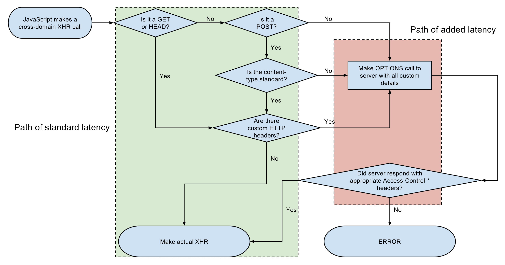

# CORS

## How CORS works

The CORS standard describes new HTTP headers which provide browsers a way to request remote URLs only when they have permission. Although some validation and authorization can be performed by the server, it is generally the browser's responsibility to support these headers and honor the restrictions they impose.

For Ajax and HTTP request methods that can modify data (usually HTTP methods other than GET, or for POST usage with certain MIME types), the specification mandates that browsers "preflight" the request, soliciting supported methods from the server with an HTTP OPTIONS request method, and then, upon "approval" from the server, sending the actual request with the actual HTTP request method. Servers can also notify clients whether "credentials" (including Cookies and HTTP Authentication data) should be sent with requests



## Simple example

Suppose a user visits `http://www.example.com` and the page attempts a cross-origin request to fetch the user's data from `http://service.example.com`. A CORS-compatible browser will attempt to make a cross-origin request to `service.example.com` as follows.

1. The browser sends the OPTIONS request with an Origin HTTP header to `service.example.com` containing the domain that served the parent page:

```
Origin: http://www.example.com
```

2.  The server at service.example.com may respond with:

    - An `Access-Control-Allow-Origin` (ACAO) header in its response indicating which origin sites are allowed. For example:

      ```
      Access-Control-Allow-Origin: http://www.example.com
      ```

      Since www.example.com matches the parent page, the browser then performs the cross-origin request.

    - An Access-Control-Allow-Origin (ACAO) header with a wildcard that allows all domains:

      ```
      Access-Control-Allow-Origin: *
      ```

    - An error page if the server does not allow a cross-origin request

A wildcard same-origin policy is appropriate when a page or API response is considered completely public content and it is intended to be accessible to everyone, including any code on any site. For example, a freely-available web font on a public hosting service like Google Fonts.

A wildcard same-origin policy is also widely and appropriately used in the object-capability model, where pages have unguessable URLs and are meant to be accessible to anyone who knows the secret.

The value of "\*" is special in that it does not allow requests to supply credentials, meaning it does not allow HTTP authentication, client-side SSL certificates, or cookies to be sent in the cross-domain request.

Note that in the CORS architecture, the ACAO header is being set by the external web service (`service.example.com`), not the original web application server (`www.example.com`). Here, service.example.com uses CORS to permit the browser to authorize `www.example.com` to make requests to `service.example.com`.
